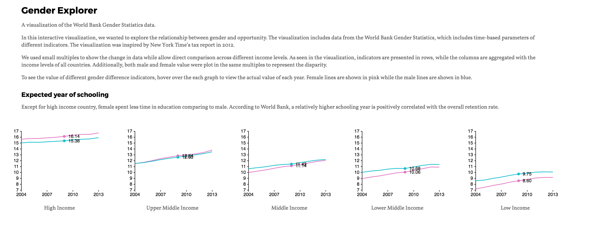

a3-rickixie-taoaoao
===============

## Team Members

1. Ricki Si Xie (rickixie)
2. Yitao Wang (yitaow)

## World Bank Gender Data Explorer 

A visualization of the [World Bank Gender Statistics data] (http://datatopics.worldbank.org/gender/home).

In this interactive visualization, we wanted to explore the relationship between gender and opportunity. The visualization includes data from the World Bank Gender Statistics, which includes time-based parameters of different indicators. The visualization was inspired by [New York Time’s tax report in 2012] (http://www.nytimes.com/interactive/2012/11/30/us/tax-burden.html).

We used small multiples to show the change in data while allow direct comparison across different income levels. As seen in the visualization, indicators are presented in rows, while the columns are aggregated with the income levels of all countries. Additionally, both male and female value were plot in the same multiples to represent the disparity. To see the value of different gender difference indicators You can hover over the each graph to view the actual value of each year. 

## Running Instructions

Access our visualization at http://cse512-16s.github.io/a3-rickixie-taoaoao/ or download this repository and run `python -m SimpleHTTPServer 9000` and access this from http://localhost:9000/.

## Story Board

Since there are multiple dimensions in the gender statistics, we thought small multiples will be an ideal representation of our dataset. To allow comparison, we also wanted to have a tooltip that show the value of a indicator across all different levels while the audiences hover over a particular year.

Similarity, we were also envisioned to have some form of filtering and sorting  to reorder the graphs to show the overall trends. We were also thinking using view manipulation where the audience can click on specific multiple and it will transition to another page that shows all the countries that belongs to the same income levels. 

We also wanted to have some curations in the data that we represented to create meaning caption for the visualization. For example, we wanted to have a subsection in the education section that includes key indicators that represent education opportunity of women and young girls, and another section for the economic and political participation of these population. 

We also prototyped our design with Tableau as shown below.

### Changes between Storyboard and the Final Implementation

A paragraph explaining changes between the storyboard and the final implementation.
####Design Decision
We utilized the [ColorBrewer](http://colorbrewer2.org/) tool to choose our color encoding of the gender data.
####Technical implementation and changes
1. Data structure: in order to create the grid structure in our visualization, we needed to transform our data accordingly. We were initially trying to created our own structure but then realized the nest() feature that d3 provided.
2. Drawing the grid: we were trying to use loops and d3 to automatically draw our multiples based on the indicators and the income level but weren't able to do so. In the end, we decided to hard code the position of each multiples in order to get some working prototypes.
3. Hover interaction: we were intially tried to have all small multiples linked with each other as the audiences hover over the graph, but there are some issues to link across rows.

## Development Process

Include:
- Breakdown of how the work was split among the group members.
  - **Ricki** worked on gathering data using the World Bank API and transform it for the visualization using python and d3, she also contributed to the styling and creating layout of the small multiples
  - **Taotao** created the multi-series visualization of the data, she also contributed to the ideation and storyboarding of the interactions

- A commentary on the development process, including answers to the following questions:
  - Roughly how much time did you spend developing your application?
    - Research and finalized the data sets: 2 days
    - Processed and retrieving the data from world bank: 1 day (included learning python)
    - Building the data visulization: 3 days+..
  - What aspects took the most time?
    - Both of us had no prior experience with d3.js and limited experience with javascript, so learning about d3 with the formatted the data took is the most time. We may also scale up the challenges than what we can do in the time that allowed. 

